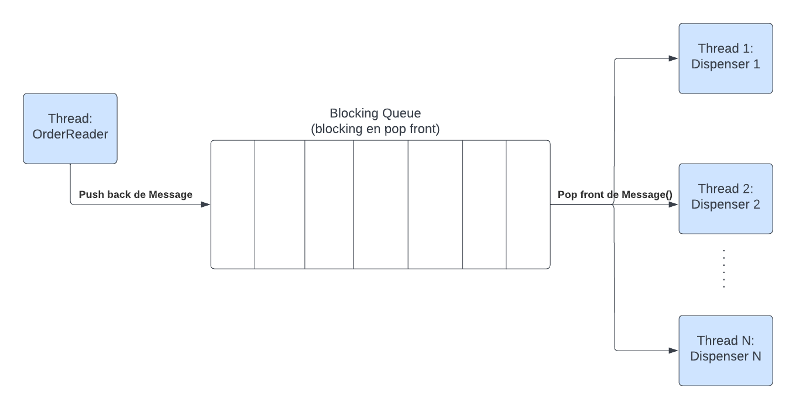

# Trabajo Práctico 1 - Internet of Coffee

[Enunciado](https://concurrentes-fiuba.github.io/2C2022_tp1.html)

## Ejecución

La aplicación lee por `stdin` los pedidos de bebidas. En particular, se puede pasar la ruta específica por donde tomar
un archivo `.csv` con los pedidos.
La idea era cambiar rápidamente de archivos, en lugar de tener que cambiar el valor de alguna constante en el código con
la ruta del archivo en cuestión.

El archivo en cuestión no debe tener headers, y el orden de las columnas debe ser el
siguiente: `cantidad_cafe | cantidad_leche | cantidad_agua`.
Es necesario que el archivo siempre tenga la misma cantidad de columnas, y que cada una de ellas contenga un número
entero positivo.
Por ejemplo, (0,1,2), (1,2,3), (1,0,1), (0,0,1), (1,0,0), (0,1,0) son líneas válidas.

    cargo run < <ruta-pedidos-csv>

Por ejemplo, si nos encontramos en el root del proyecto:

    cargo run < src/order-examples/orders.csv

## Hipótesis y supuestos

Las hipótesis y supuestos tomados para el desarrollo del presente trabajo práctico fueron:

- La capacidad de los contenedores de granos de café para moler y de leche fría para convertir en leche espumada debe
  ser suficiente (configurable) para satisfacer todos los pedidos.
- Cuando no se tiene los recursos necesarios para satisfacer un pedido, el correspondiente contenedor de granos de café
  o de leche fría reabastece los contenedores principales
  con un factor de reabastecimiento configurable para no tener que reabastece cada vez que se necesite un recurso. Esto
  confronta de alguna manera con el requerimiento de
  "_Cuando el contenedor de cafe molido se agota, el molinillo automático toma una cantidad de granos y los convierte en
  café molido._",
  ya que no se espera a que se agote un recurso, pero es mejor que descartar un pedido. De todas maneras, existe el
  mecanismo de conversión una vez que se agota un recurso.
- El orden de aplicación de los recursos es el siguiente: `café molido -> leche espumada -> agua`, si corresponde.
- Se aceptan pedidos de solo leche, solo café, solo agua, o de cualquier combinación de los mismos. Esto es para mostrar
  que, por ejemplo,
  si se está utilizando el café molido en algún pedido, todavía es posible completar pedidos de solo leche o solo agua (
  o una combinación de ambas).
- El tiempo de preparación de una bebida es la suma del tiempo de procesamiento de cada recurso involucrado en la
  elaboración de la misma. Dicho tiempo de procesamiento está afectado por un factor de procesamiento (configurable) y
  por la cantidad de recursos que
  se estén utilizando en el momento.
- No se lleva la estadística del agua utilizada o consumida, ya que se entiende que para el negocio (inclusive en nivel
  de costo) tiene mayor impacto el café y la leche utilizados.

## Detalles de implementación

A nivel general, y para cumplir con los requisitos funcionales planteados en el trabajo práctico, se tienen los
siguientes _actores_ (threads) dentro del
`struct CoffeeMachine`:

**Observación**: cuando se dice que algo es _configurable_ se refiere que se puede cambiar el valor de la constante
en `constants.rs`

- **N dispensers**: donde `N` es una constante configurable. Cada uno de estos threads se encarga de aplicar café
  molido, leche espumada y/o agua caliente
  según corresponda. Toman los pedidos desde una `BlockingQueue` la cual es compartida con el thread de **Lector de
  pedidos**. Dicha cola es unbounded
  y es bloqueante solo al momento de tomar un elemento de la misma en caso deq que esté vacía.
- **Lector de pedidos**: se encarga de leer los pedidos desde `stdin` (en particular, un archivo `.csv`) y los envía a
  la `BlockingQueue`
  compartida con los N dispensers.
- **Estadísticas**: imprime periódicamente las estadísticas de la máquina de café. Dichas estadísticas incluyen la
  cantidad de pedidos completados,
  el nivel de cada recurso actualmente y la cantidad consumida respectivamente.
- **Refill de leche espumada**: se encarga de reabastecer el contenedor de leche espumada cuando se agota utilizando el
  contenedor de leche fría.
- **Refill de café**: se encarga de reabastecer el contenedor de café molido cuando se agota utilizando el contenedor de
  granos de café para moler.
- **Alerta de recursos de café**: informa cuando el nivel de los granos de café molido se encuentra por debajo de cierto
  threshold configurable a partir
  del nivel de café molido con el que se inició la ejecución.
- **Alerta de recursos de leche**: informa cuando el nivel de leche espumada se encuentra por debajo de cierto threshold
  configurable a partir
  del nivel de leche espumada con el que se inició la ejecución.

Por supuesto, también se cuenta con el thread principal de `main`.

Además, algunos detalles de implementación de más bajo nivel incluyen:

- Los pedidos no son leídos todos de inmediato, sino que entre cada pedido leído se ejecuta un `sleep` con un tiempo
  configurable.
  La motivación era simular que no todos los customers llegan al mismo tiempo, sino que lo van haciendo de a uno cada
  cierto tiempo.
- Las estadísticas se informan periódicamente (ejecutando un `sleep`) cada cierto tiempo configurable. Otra alternativa
  hubiera sido informarlas cada vez que se completen X pedidos usando una `Condvar` sobre el contador de bebidas.

### Comunicación y sincronización entre threads

Si bien el trabajo práctico consistía en utilizar las herramientas de estado mutable compartido, tenemos que utilizar
dichas
herramientas que hagan que todo el proceso sea lo más _dinámico_ posible. A tal fin, las estructuras con las que se
cuentan son las siguientes:

- **Contenedores de granos de café molido y leche espumada**: cada uno protegido por un `Mutex` y una `Condvar`
  independiente. Cada contenedor posee la cantidad actual
  del recurso y la cantidad utilizada hasta el momento. La `Condvar` es usada para notificar (y esperar
  mediante `wait_while`) a los threads que los recursos se han agotado o que llegaron a un cierto nivel
  que precisan ser informados. Como se mencionó en la sección de [Hipótesis y supuestos](#Hipótesis-y-supuestos), el
  orden en que se aplican los recursos no es aleatorio, pero
  una vez que un recurso se ha aplicado para preparar una bebida, se libera el lock del `Mutex` correspondiente para que
  otros threads puedan emplearlo.
- **Contenedores de granos de café para moler y leche fría**: cada uno protegido por un `Mutex` independiente. En estos
  contenedores no se utiliza una `Condvar` debido a que
  la condición de esperar recae sobre los contendores mencionados en el item anterior. El lock de estos se obtiene
  cuando hay que reabastecer los contendores principales.
- **Variable de shutdown**: un `AtomicBool` para facilitar el shutdown una vez que no hay más pedidos que leer.
  Soluciona el problema de notificar a aquellos threads que se encuentran esperando
  ser notificados por la `Condvar` de los contenedores principales. Se utiliza un `AtomicBool` para evitar el uso de
  un `Mutex` y probar algo diferente.
- **Cola bloqueante**: como ya se mencionó, es una `BlockingQueue` compartida entre el thread lector y los N dispensers.
- **Contador de pedidos completados**: protegido por un `Mutex` y se toma el lock cuando un dispenser termina de
  preparar una bebida, o se necesita imprimir las estadísticas.

### Finalización de la ejecución

La finalización de la ejecución se da cuando se terminan de leer todos los pedidos del archivo `.csv` y se terminan de
procesar todos los pedidos que pudieran haber quedado en la cola o en preparación.

La secuencia se da de la siguiente manera teniendo en cuenta que el thread principal se queda esperando que los threads
que representan los dispensers terminen:

1) El thread **lector de pedidos** envía a la cola bloqueante un mensaje del tipo `Message::Shutdown` para indicar que
   no hay más pedidos que leer. Esto lo realiza N veces donde N
   es la cantidad de dispensers que se crearon. El thread de **lector de pedidos** finaliza su ejecución.
2) Una vez que no haya más pedidos en la cola y los dispensers hayan terminado de procesar todos los pedidos, toman
   los `Message::Shutdown` y finalizan su ejecución.
3) Desde el thread principal, se actualiza la variable de shutdown.
4) Los threads que estén esperando con un `wait_while` o con un loop periódico se despiertan y finalizan su ejecución al
   leer la variable de shutdown.
5) El thread principal finaliza su ejecución, imprimiendo las estadísticas finales.

### Crates utilizados

El único crate utilizado para el desarrollo del presente trabajo práctico fue `csv`, para facilitar la lectura y parseo
de los archivos `.csv` que contienen los pedidos.

### Cuestiones a mejorar

- **Testing automatizado**: no se realizaron test automatizados para el presente trabajo práctico. Sin embargo, si se
  probó con diferentes inputs el comportamiento esperado.
  Me hubiera gustado probar sobre todo `loom`, pero frente a diversos compromisos y estar ajustado de tiempo, prioricé
  realizar las funcionalidades que cumplan los requerimientos planteados.
- **Manejo de errores**: En todos los casos en donde una función o método devolvía un `Result`, se hizo un `expect` para
  simplificar el código. Muchos de estos errores eran irrecuperables,
  por lo tanto, para ser consistentes con el manejo de errores se hizo un `expect`. No obstante, hubiera sido mejor
  manejarlos de una manera más elegante.
